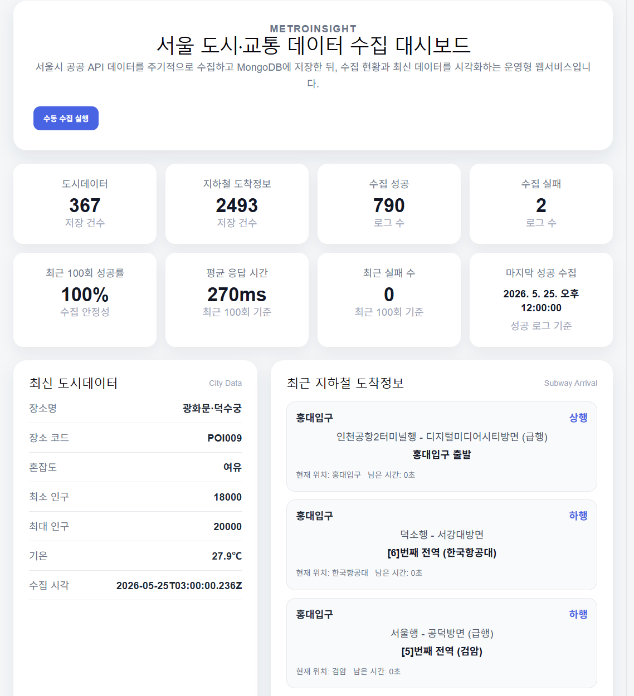
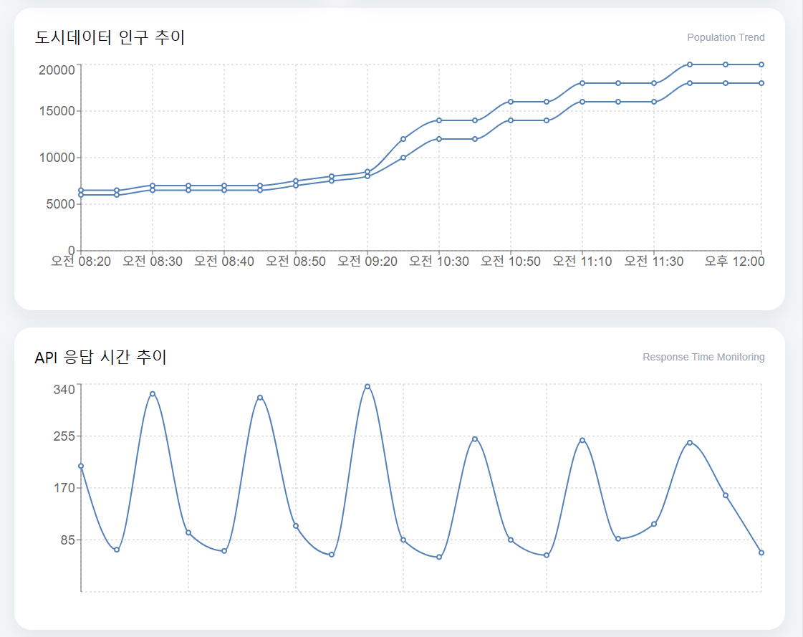
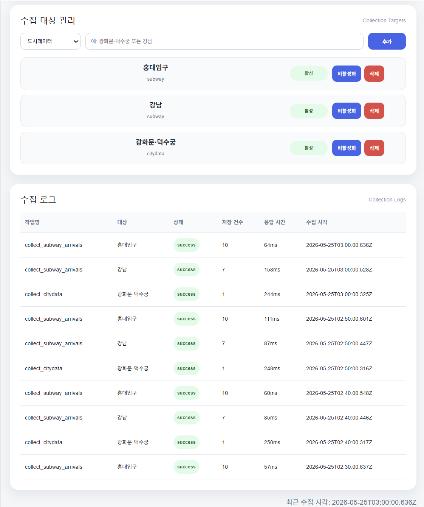
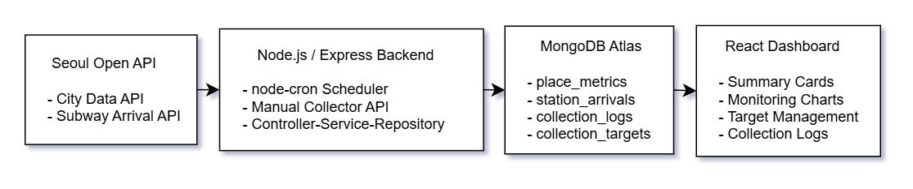

# MetroInsight

서울 도시·교통 데이터 수집 및 운영 대시보드

> 서울시 공공 API에서 도시·교통 데이터를 주기적으로 수집하고, MongoDB에 저장한 뒤, React 대시보드에서 수집 현황·지하철 도착정보·수집 로그·운영 지표를 확인할 수 있는 풀스택 웹서비스입니다.

---

## Demo

- Frontend: https://metro-insight-one.vercel.app
- Backend Health Check: https://metro-insight-api.onrender.com/health
- Dashboard Summary API: https://metro-insight-api.onrender.com/api/dashboard/summary

---

## Highlights

- 서울시 공공 API 기반 도시·교통 데이터 자동 수집
- MongoDB Atlas에 도시데이터, 지하철 도착정보, 수집 로그, 수집 대상 정보를 분리 저장
- 관리자 화면에서 수집 대상 추가·비활성화·삭제 및 수동 수집 실행 가능
- 최근 100회 수집 성공률, 평균 응답 시간, 실패 로그를 대시보드에서 모니터링
- 수집 시각과 남은 도착 시간을 기준으로 지하철 도착정보 신선도 필터 적용
- Controller-Service-Repository 구조로 백엔드 책임 분리
- React 컴포넌트 분리로 대시보드 UI 유지보수성 개선
- Vercel, Render, MongoDB Atlas 기반 풀스택 배포 완료

> 현재 프로젝트는 포트폴리오 구현 범위상 관리자 인증은 생략했으며, 실제 운영 환경에서는 수동 수집 실행과 수집 대상 관리 기능에 인증/권한 검증이 필요합니다.

---

## Preview

### Dashboard Overview

수집 현황 요약, 최신 도시데이터, 지하철 도착정보를 한 화면에서 확인할 수 있습니다.



### Monitoring Charts

도시데이터 인구 추이와 API 응답 시간 추이를 시각화해, 수집 데이터의 변화와 외부 API 호출 상태를 함께 확인할 수 있습니다.



### Collection Target & Logs

관리자가 수집 대상을 추가·비활성화·삭제할 수 있고, 각 수집 작업의 성공 여부와 응답 시간을 로그로 확인할 수 있습니다.



---
## Why I Built This

공공 API를 활용한 프로젝트는 보통 데이터를 가져와서 화면에 보여주는 데서 끝나는 경우가 많습니다.  
하지만 실제 서비스에서는 데이터를 가져오는 것만큼이나 중요한 문제가 있습니다.

- 외부 API 호출이 실패했을 때 어떻게 기록할 것인가?
- 수집된 데이터가 최신인지 어떻게 판단할 것인가?
- 수집 대상을 코드 수정 없이 바꿀 수 있는가?
- 운영자가 수집 상태를 한눈에 확인할 수 있는가?
- 필요할 때 수동으로 데이터를 다시 수집할 수 있는가?

MetroInsight는 이 문제의식에서 출발했습니다.

단순한 데이터 시각화가 아니라, **외부 API 수집 → MongoDB 저장 → 자동 스케줄링 → 수집 로그 관리 → 운영 대시보드**까지 연결된 백오피스형 웹서비스를 목표로 구현했습니다.

---

## Architecture


```txt
서울시 공공 API
  ├─ 서울 실시간 도시데이터 API
  └─ 서울 지하철 실시간 도착정보 API
        ↓
Node.js / Express Backend
  ├─ node-cron 자동 수집
  ├─ 수동 수집 실행 API
  ├─ 수집 대상 관리
  ├─ 수집 로그 기록
  └─ Controller-Service-Repository 구조
        ↓
MongoDB Atlas
  ├─ place_metrics
  ├─ station_arrivals
  ├─ collection_logs
  └─ collection_targets
        ↓
React Dashboard
  ├─ 수집 현황 요약
  ├─ 최신 도시데이터
  ├─ 지하철 도착정보
  ├─ 인구 추이 차트
  ├─ API 응답 시간 차트
  ├─ 수집 대상 관리
  └─ 수집 로그 테이블
```
---

## Tech Stack

| Area | Stack |
|---|---|
| Frontend | React, Vite, Axios, Recharts |
| Backend | Node.js, Express.js |
| Database | MongoDB Atlas, Mongoose |
| Scheduler | node-cron |
| Deploy | Vercel, Render |
| API Source | 서울시 공공 API |
| Version Control | Git, GitHub |

---

## Main Features

### 1. 서울시 공공 API 데이터 수집

서울시 공공 API에서 도시·교통 데이터를 수집합니다.

- 서울 실시간 도시데이터
- 서울 지하철 실시간 도착정보

수집된 데이터는 화면에 바로 보여주는 데서 끝나지 않고, MongoDB에 저장해 최신 상태와 수집 이력을 확인할 수 있도록 했습니다.

---

### 2. 자동 수집 스케줄러

`node-cron`을 사용해 서버가 주기적으로 데이터를 수집하도록 구현했습니다.

```txt
10분마다 활성 수집 대상 조회
↓
도시데이터 또는 지하철 API 호출
↓
MongoDB 저장
↓
수집 성공/실패 로그 기록
```
초기에는 수집 대상이 코드에 고정되어 있었지만, 이후 운영성을 고려해 DB 기반 수집 대상 관리 구조로 개선했습니다.

---

### 3. 수집 대상 관리

관리자 화면에서 수집 대상을 직접 추가, 비활성화, 삭제할 수 있습니다.

예시:

```txt
citydata / 광화문·덕수궁 / 활성
subway / 강남 / 활성
subway / 홍대입구 / 활성
```

스케줄러는 코드에 하드코딩된 장소가 아니라, MongoDB의 `collection_targets` 컬렉션에서 `isActive: true`인 대상만 조회해 수집합니다.

이 구조를 통해 수집 대상을 변경할 때 서버 코드를 수정하지 않아도 됩니다.

---

### 4. 수동 수집 실행

자동 스케줄러 외에도, 관리자가 대시보드에서 직접 수집을 실행할 수 있도록 했습니다.

```txt
수동 수집 실행 버튼 클릭
↓
POST /api/admin/run-collector
↓
활성화된 수집 대상 전체 수집
↓
수집 로그 저장
↓
대시보드 데이터 갱신
```

이 기능을 통해 운영자가 필요할 때 즉시 데이터를 다시 수집할 수 있습니다.

---

### 5. 수집 로그 관리

외부 API는 항상 정상 응답한다고 가정할 수 없습니다.  
그래서 모든 수집 작업의 결과를 `collection_logs`에 저장했습니다.

수집 로그에는 다음 정보를 저장합니다.

- 작업명
- 수집 대상
- 성공/실패 상태
- 저장 건수
- 응답 시간
- 에러 메시지
- 수집 시각

이를 통해 단순히 “데이터를 가져왔다”에서 끝나는 것이 아니라, 수집 작업 자체의 상태를 운영자가 확인할 수 있도록 했습니다.

---

### 6. 운영 상태 모니터링

대시보드 상단에는 단순 저장 건수뿐 아니라, 운영 상태를 확인할 수 있는 지표를 추가했습니다.

- 도시데이터 저장 건수
- 지하철 도착정보 저장 건수
- 전체 수집 성공 로그 수
- 전체 수집 실패 로그 수
- 최근 100회 수집 성공률
- 최근 100회 평균 응답 시간
- 최근 100회 실패 수
- 마지막 성공 수집 시각

이 기능은 데이터 자체뿐 아니라, 데이터 수집 파이프라인의 안정성을 확인하기 위한 목적입니다.

---

### 7. 데이터 신선도 필터

지하철 도착정보는 실시간성이 중요한 데이터입니다.  
초기 구현에서는 MongoDB에 저장된 최신 데이터를 그대로 보여주었기 때문에, 운행 시간이 아니거나 오래된 데이터가 현재 정보처럼 보일 수 있었습니다.

이를 개선하기 위해 다음 조건을 적용했습니다.

```txt
최근 15분 이내 수집된 데이터만 표시
남은 도착 시간이 30분 이하인 데이터만 표시
```

이를 통해 오래된 도착정보나 과도하게 먼 도착 예정 정보가 현재 정보처럼 보이지 않도록 처리했습니다.

---

### 8. 데이터 시각화

React 대시보드에서 Recharts를 활용해 두 가지 차트를 구현했습니다.

1. 도시데이터 인구 추이
   - 최소 인구
   - 최대 인구

2. API 응답 시간 추이
   - 최근 수집 로그 기준 응답 시간 변화

단순 조회 화면이 아니라, 운영자가 수집 상태와 데이터 흐름을 빠르게 파악할 수 있는 대시보드를 목표로 구성했습니다.

---
## Data Flow

```txt
1. 관리자가 수집 대상 등록
   ↓
2. collection_targets에 대상 저장
   ↓
3. node-cron 스케줄러가 활성 대상 조회
   ↓
4. 서울시 공공 API 호출
   ↓
5. MongoDB에 수집 데이터 저장
   ↓
6. collection_logs에 수집 결과 저장
   ↓
7. React 대시보드에서 조회 및 시각화
```
---

## API Documentation

### Dashboard

| Method | Endpoint | Description |
|---|---|---|
| GET | `/api/dashboard/summary` | 대시보드 요약 지표 조회 |

### Place Metrics

| Method | Endpoint | Description |
|---|---|---|
| GET | `/api/place-metrics/latest` | 최신 도시데이터 조회 |

### Station Arrivals

| Method | Endpoint | Description |
|---|---|---|
| GET | `/api/station-arrivals/latest` | 최신 지하철 도착정보 조회 |

### Admin

| Method | Endpoint | Description |
|---|---|---|
| GET | `/api/admin/collection-logs` | 수집 로그 조회 |
| POST | `/api/admin/run-collector` | 수동 수집 실행 |
| GET | `/api/admin/collection-targets` | 수집 대상 목록 조회 |
| POST | `/api/admin/collection-targets` | 수집 대상 추가 |
| PATCH | `/api/admin/collection-targets/:id/toggle` | 수집 대상 활성/비활성 전환 |
| DELETE | `/api/admin/collection-targets/:id` | 수집 대상 삭제 |

---

## MongoDB Collections

### place_metrics

서울 실시간 도시데이터를 저장합니다.

```js
{
  placeName: String,
  areaCode: String,
  congestionLevel: String,
  populationMin: Number,
  populationMax: Number,
  temperature: Number,
  collectedAt: Date,
  rawPayload: Object
}
```

### station_arrivals

지하철 실시간 도착정보를 저장합니다.

```js
{
  stationName: String,
  subwayId: String,
  direction: String,
  trainLineName: String,
  arrivalMessage: String,
  currentLocation: String,
  remainingTimeSec: Number,
  receivedAt: Date,
  collectedAt: Date,
  rawPayload: Object
}
```

### collection_logs

수집 작업 결과를 저장합니다.

```js
{
  jobName: String,
  targetType: String,
  targetName: String,
  status: "success" | "failed",
  savedCount: Number,
  responseTimeMs: Number,
  errorMessage: String,
  collectedAt: Date
}
```

### collection_targets

자동 수집 대상을 저장합니다.

```js
{
  type: "citydata" | "subway",
  name: String,
  isActive: Boolean
}
```

---

## Project Structure

```txt
metro-insight/
  backend/
    src/
      config/
        db.js
      controllers/
        adminController.js
        dashboardController.js
        placeMetricController.js
        stationArrivalController.js
      jobs/
        collectorJob.js
        scheduler.js
      models/
        CollectionLog.js
        CollectionTarget.js
        PlaceMetric.js
        StationArrival.js
      repositories/
        adminRepository.js
        dashboardRepository.js
        placeMetricRepository.js
        stationArrivalRepository.js
      routes/
        adminRoutes.js
        dashboardRoutes.js
        placeMetricRoutes.js
        stationArrivalRoutes.js
      services/
        adminService.js
        dashboardService.js
        placeMetricService.js
        stationArrivalService.js
        seoulCityDataService.js
        seoulSubwayService.js
      app.js
      server.js

  frontend/
    src/
      components/
        HeroSection.jsx
        SummaryCards.jsx
        LatestCityData.jsx
        SubwayArrivalList.jsx
        PopulationChart.jsx
        ResponseTimeChart.jsx
        CollectionTargetManager.jsx
        CollectionLogTable.jsx
      App.jsx
      App.css
      main.jsx
```

---

## Design Decisions

### 왜 MongoDB를 사용했는가?

수집하는 데이터가 도시데이터와 지하철 도착정보로 나뉘고, 두 API의 응답 구조가 서로 달랐습니다.  
또한 원본 응답을 함께 저장해두면 나중에 필드 추가나 파싱 로직 수정이 필요할 때 다시 확인할 수 있다고 판단했습니다.

그래서 정형 테이블에 맞춰 데이터를 먼저 강하게 제한하기보다, 원본 JSON을 보존하면서 빠르게 저장할 수 있는 MongoDB를 사용했습니다.

다만 복잡한 조인이나 정형 분석이 중요해진다면, 이후에는 별도의 RDB 기반 분석 마트로 확장할 수 있다고 생각했습니다.

---

### 왜 수집 로그를 별도로 저장했는가?

외부 API 기반 서비스에서는 데이터 자체뿐 아니라, 수집 작업이 안정적으로 실행되고 있는지 확인하는 것이 중요하다고 생각했습니다.

그래서 수집 성공 여부, 저장 건수, 응답 시간, 실패 메시지를 `collection_logs`에 따로 저장했습니다.

이를 통해 운영자는 다음을 확인할 수 있습니다.

- 어떤 대상이 정상 수집되었는가?
- 최근 실패가 발생했는가?
- API 응답 시간이 느려지고 있는가?
- 수집 작업이 실제로 계속 실행되고 있는가?

---

### 왜 Controller-Service-Repository 구조로 분리했는가?

초기에는 route 파일 안에서 DB 조회와 응답 처리까지 함께 작성했습니다.  
하지만 기능이 늘어나면서 route 파일이 비대해질 수 있다고 판단했습니다.

그래서 백엔드 구조를 다음과 같이 분리했습니다.

```txt
Route
  → URL 매핑

Controller
  → 요청/응답 처리

Service
  → 비즈니스 로직 처리

Repository
  → MongoDB 접근
```

예시 흐름은 다음과 같습니다.

```txt
GET /api/dashboard/summary
↓
dashboardRoutes
↓
dashboardController
↓
dashboardService
↓
dashboardRepository
↓
MongoDB
```

이 구조를 통해 API 요청 처리, 비즈니스 로직, DB 접근 책임을 분리했습니다.

---

## Key Improvements

### 1. 코드 고정 수집 대상 → DB 기반 수집 대상 관리

초기에는 수집 대상이 코드에 직접 고정되어 있었습니다.

```js
collectCityData("광화문·덕수궁");
collectSubwayArrivals("강남");
```

이 구조는 수집 대상을 바꿀 때마다 코드를 수정해야 한다는 한계가 있었습니다.

개선 후에는 MongoDB의 `collection_targets`에서 활성화된 대상만 읽어 수집하도록 변경했습니다.

```txt
collection_targets 조회
↓
isActive: true인 대상만 수집
```

이를 통해 운영자가 관리자 화면에서 수집 대상을 추가·비활성화·삭제할 수 있도록 개선했습니다.

---

### 2. 단순 최신 데이터 표시 → 데이터 신선도 필터 적용

지하철 도착정보는 실시간성이 중요한 데이터이기 때문에, 오래된 데이터가 현재 정보처럼 보이면 사용자에게 혼란을 줄 수 있습니다.

초기에는 MongoDB에 저장된 최신 도착정보를 그대로 보여주었지만, 이후 다음 조건을 적용했습니다.

```txt
최근 15분 이내 수집된 데이터만 표시
남은 도착 시간이 30분 이하인 데이터만 표시
```

이를 통해 오래된 도착정보나 과도하게 먼 도착 예정 정보가 현재 정보처럼 보이지 않도록 개선했습니다.

---

### 3. 수집 성공 여부뿐 아니라 응답 시간까지 모니터링

외부 API 수집 작업은 성공 여부뿐 아니라 응답 시간도 중요하다고 판단했습니다.

그래서 수집 로그에 `responseTimeMs`를 저장하고, 대시보드에서 다음 지표를 확인할 수 있도록 했습니다.

- 최근 100회 평균 응답 시간
- API 응답 시간 추이 차트
- 수집 대상별 응답 시간 로그

이를 통해 외부 API 호출 안정성을 운영 지표로 확인할 수 있도록 개선했습니다.

---

### 4. 프론트엔드 컴포넌트 분리

초기에는 `App.jsx`에 대부분의 화면 코드가 들어 있었습니다.  
대시보드 기능이 늘어나면서 유지보수가 어려워질 수 있다고 판단해 주요 UI를 컴포넌트 단위로 분리했습니다.

분리한 컴포넌트는 다음과 같습니다.

- `HeroSection`
- `SummaryCards`
- `LatestCityData`
- `SubwayArrivalList`
- `PopulationChart`
- `ResponseTimeChart`
- `CollectionTargetManager`
- `CollectionLogTable`

이를 통해 `App.jsx`는 데이터 요청과 상태 관리 중심으로 정리하고, 화면 구성은 각 컴포넌트가 담당하도록 개선했습니다.

---

### 5. 환경변수 분리 및 배포 환경 대응

초기에는 프론트엔드 코드에 `http://localhost:4000`이 직접 작성되어 있었습니다.

하지만 배포 환경에서는 localhost를 사용할 수 없기 때문에, Vite 환경변수로 API 주소를 분리했습니다.

```env
VITE_API_BASE_URL=http://localhost:4000
```

배포 환경에서는 Vercel 환경변수에 Render 백엔드 URL을 설정했습니다.

```env
VITE_API_BASE_URL=https://metro-insight-api.onrender.com
```

백엔드의 MongoDB URI와 서울시 API 키는 `.env`로 관리하고, GitHub에는 `.env.example`만 포함했습니다.

---

## Troubleshooting

### 1. 한글 수집 대상이 깨지는 문제

PowerShell에서 한글 JSON body를 직접 보낼 때 `강남`이 `??`처럼 깨지는 문제가 있었습니다.  
이후 프론트엔드 입력 폼을 통해 수집 대상을 추가하도록 개선했고, API 테스트 시에는 유니코드 이스케이프 형태를 사용해 문제를 확인했습니다.

---

### 2. 오래된 지하철 도착정보가 화면에 남는 문제

MongoDB에 저장된 최신 데이터를 그대로 보여주면 운행 종료 시간대에도 마지막 도착정보가 화면에 남을 수 있었습니다.  
이를 해결하기 위해 `collectedAt`과 `remainingTimeSec` 기준의 신선도 필터를 적용했습니다.

---

### 3. 로컬 API 주소가 배포 환경에서 동작하지 않는 문제

프론트엔드 코드에 `localhost`가 직접 들어가 있으면 배포 환경에서 백엔드 API를 찾을 수 없습니다.  
이를 해결하기 위해 `VITE_API_BASE_URL` 환경변수를 사용해 로컬과 배포 환경의 API 주소를 분리했습니다.

---

## Environment Variables

### Backend

`backend/.env`

```env
PORT=4000
MONGODB_URI=your_mongodb_atlas_connection_string
SEOUL_CITY_API_KEY=your_seoul_citydata_api_key
SEOUL_SUBWAY_API_KEY=your_seoul_subway_api_key
```

### Frontend

`frontend/.env`

```env
VITE_API_BASE_URL=http://localhost:4000
```

---

## How to Run Locally

### Backend

```bash
cd backend
npm install
npm run dev
```

### Frontend

```bash
cd frontend
npm install
npm run dev
```

---

## Deployment

| Part | Platform |
|---|---|
| Frontend | Vercel |
| Backend | Render |
| Database | MongoDB Atlas |

```txt
Vercel Frontend
↓
Render Backend
↓
MongoDB Atlas
```

---

## What I Learned

이 프로젝트를 진행하면서 단순히 데이터를 가져와 보여주는 것보다, 데이터를 안정적으로 수집하고 운영 가능한 형태로 관리하는 구조가 중요하다는 점을 경험했습니다.

특히 다음 부분을 중점적으로 학습했습니다.

- 외부 API 연동과 예외 처리
- Node.js 기반 주기적 데이터 수집
- MongoDB 문서 구조 설계
- 수집 로그 기반 운영 모니터링
- React 대시보드 구성
- 환경변수 기반 로컬/배포 환경 분리
- Controller-Service-Repository 구조를 통한 책임 분리
- Vercel, Render, MongoDB Atlas를 활용한 풀스택 배포

MetroInsight는 단순한 데이터 시각화 프로젝트가 아니라, 데이터 수집 작업의 운영 상태까지 함께 관리하는 백오피스형 웹서비스를 목표로 구현했습니다.
